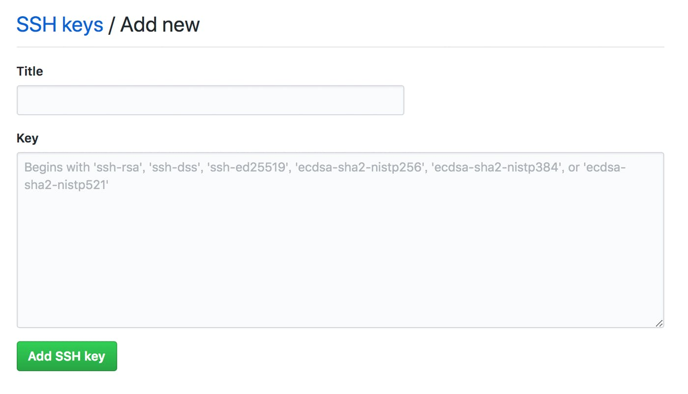

# GitHub のリポジトリにアクセスするための設定

内藤広志

### 更新履歴
 2019/10/23 初版の作成
 2019/10/25 次の誤りの修正、コマンドの出力の追加
 1. alias のバッククォートの誤りを修正
 2019/10/27 FAST-forward マージを禁止する。

## 1. xclip のインストール

### 1) xclip をインストールする

```bash
% sudo apt-get install xclip -y
```

### 2) xclip の別名 pbcopy を .bashrc に登録する

' (１重引用符) であるので間違えないこと。

```bash
% echo "alias pbcopy='xclip -selection clipboard'" >> ~/.bashrc
```

## 2. SSH認証キーの作成

### 1) SSH認証キーを作成する

すべて Enter キーを入力する。パスフレーズを入力すると、GitHub への接続がアボートする。

以降、$USER はログインユーザーの名前を示す。
```bash
% ssh-keygen -t rsa
Generating public/private rsa key pair.
Enter file in which to save the key (/home/$USER/.ssh/id_rsa): 
Enter passphrase (empty for no passphrase): 
Enter same passphrase again: 
Your identification has been saved in /home/$USER/.ssh/id_rsa.
Your public key has been saved in /home/$USER/.ssh/id_rsa.pub.
以降省略
```

### 2) ~/.ssh/config の編集

次の GitHub の接続設定を追加する。タブもこの通りに入力する。

```text
Host github
  HostName github.com
  IdentityFile ~/.ssh/id_rsa
  Port 22
  User git
```

### 3) 秘密鍵をアクセス権を設定する

```bash
% cd ~/.ssh
% chmod 600 id_rsa
```

### 4) ssh-agentに秘密鍵を登録する

```bash
% eval `ssh-agent`
Agent pid 10263
% ssh-add ~/.ssh/id_rsa
Identity added: /home/$USER/.ssh/id_rsa (/home/$USER/.ssh/id_rsa)
```

### 5) 登録されたか確認する

```bash
% ssh-add -l
2048 SHA256:fingerprintは省略 /home/$USER/.ssh/id_rsa (RSA)
```

### 6) 公開鍵をコピーする

```bash
% pbcopy < ~/.ssh/id_rsa.pub
```

## 3. GitHub にSSH Keysを登録

1. GitHub にログインし、メニューバーの右上のドロップダウンメニューから「settings」を実行する。
1. ページのサイドバーの「SSH and GPG keys」 を選択する。
1. 「New SSH Key」ボタンを押す。、「Key」項目に公開鍵を貼り付けて「Add SSH key」をクリック。の設定ページを表示する。
1. 次の画面が表示されるので、「Title」欄に WLDL15 を入力する。
  
1. 端末ウィンドウに戻り、次のコマンドを実行する。  
        % pbcopy < ~/.ssh/id_rsa.pub  
1. 「Key」欄にコピーした公開鍵をペースト (Ctrl-v) する。
1. 「Add SSH key」ボタンを押す。

## 4. GitHub の設定

GitHub に登録したユーザー名とメールアドレスを設定する。

```bash
% git config --global user.name "ユーザー名"
% git config --global user.email メールアドレス
```

FAST-forward マージを禁止する。

```bash
% git config --global --add merge.ff false
```

## 5. 公開鍵が登録されたか確認する

次のコマンドを実行し、質問「Are you sure ...」の答えとして yes を入力する。

```bash
% ssh -T git@github.com
The authenticity of host 'github.com (52.69.186.44)' can't be established.
RSA key fingerprint is SHA256:省略.
Are you sure you want to continue connecting (yes/no)? yes
Warning: Permanently added 'github.com,52.69.186.44' (RSA) to the list of known hosts.
Hi ユーザー名! You've successfully authenticated, but GitHub does not provide shell access.
```

## 6. GitHub リポジトリにアクセスし、push できるかを確認する

### 1) WLDL15/TEST リポジトリをクローンする

リモートリポジトリをクローンし、その URL を確認する。

```bash
% cd ~/projects
% git clone https://github.com/WLDL15/TEST.git
省略
% git remote -v
origin  git@github.com:ruby/WLDL15/TEST.git (fetch)
origin  git@github.com:ruby/WLDL15/TEST.git (push)
```

### 2) WLDL15/TEST リポジトリを VSCode で開く

VSCode で ~/projects/TEST ディレクトリを開く。ソース管理アイコンをクリックし、ソース管理に git が設定されていることを確認する。

### 3) VSCode でターミナルを開く

「ターミナル」の「新しいターミナル」メニューを実行し、ターミナルを開く。

### 4) 新しいブランチを作成する

ターミナルで次を実行して、新しいブランチを作成し、それを作業ツリーとする。端末ウィンドウだと日本語が文字化けすることがあるため。

```bash
% git branch
* master

% git status
ブランチ master
Your branch is up to date with 'origin/master'.
nothing to commit, working tree clean

% git checkout -b $USER/newbranch
Switched to a new branch 'ユーザー名/newbranch'
```

### 5) 新しいファイルをリモートリポジトリに push する

新しいファイルを作成し、次のコマンドを実行して、そのファイルをリモートリポジトリに push する。

```bash
% git add 新しいファイルの名前
% git commit -m "[add] 新しいファイルの追加"
% git push origin ユーザー名/newbranch
```

### 6) WLDL15/TEST リポジトリの確認

WLDL15/TEST リポジトリをブラウザで表示し、「branches」タブを開き、push したブランチがあるかを確認する。

## 参考ページ

1. How to use pbcopy on Ubuntu (https://garywoodfine.com/use-pbcopy-on-ubuntu/)
2. 新しいMacでGitHubのSSH接続をするまでの環境構築手順 (qiita.com)